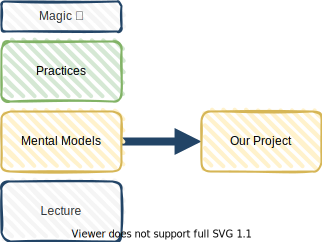

<!-- markdownlint-disable MD025 MD045 MD012 MD024 MD026 -->

# Project Management 1

## Lesson 01 - Orientation

---

<!-- _backgroundColor: lightblue -->
# Check In

``` none
What aspects of project management are known to me?

What concrete questions do I have towards project management?
```

1. Find a partner (aka a breakout group with 1 participant) and share, 2 min each. ⏲️4min
2. All: Come back to the whole group and do a second round with a different partner. ⏲️4min
3. [Debrief](https://facilitation-tools.org/debriefing-cube/?lang=en&id=4.5) ⏲️4min

---

# Where are we, where do we start?

* DHBW Mosbach - Project Management 1
* 11 lessons from Nov 29th to Feb 21th 2024
* will lead to Project Management 2, combined with Web Engineering later this year
* Today: Orientation
* And who is the teacher?
* English, ~~Deutsch~~?

---

# Orientation

1. Define Team Agreements
2. Course Structure Orientation, Learning Objectives
3. Project Management Orientation
4. And more
   1. Tool Nugget
   2. More Material

---

# Team Agreements

A team agreement (or a team contract) is **a written document detailing how a team agrees to work together**. Team agreements can describe procedures such as decision-making processes, how to get support, and the tools and communication methods that the team uses.

* ➡️ see also Working Agreement
* ➡️ good enough for now, safe enough to try?
* ➡️ Use [Protocol Check](https://liveingreatness.com/core-protocols/protocol-check/) when needed.

<!--
footer: 'Source: [Remote Team Agreements and Protocols](https://www.holloway.com/g/remote-work/sections/remote-team-agreements-and-protocols)'
-->

---

# Our Team Agreement Proposal (v1)

1. 🗣️  Constructive Feedback is always welcome, in all directions.
2. 🌱  We are all experts and learners at the same time.
3. ⌚  We are on time and we finish on time.
4. 🙏  Help each other to learn and to feel welcome.
5. 🙋  To learn is to actively participate.
6. 🔌  When energy is low, call for an energizer!
7. 🎉  Let's have fun learning and growing.

<!-- footer: ''
-->

---
<!-- _backgroundColor: lightblue -->

# Perfection Game - Team Agreement

1. ➡️ Go to our workspace (new tool! yay!)
2. Round: Clarifying Questions?
3. ⏲️10min Perfection Round (Popup)
   1. Perfector rates the agreement on a scale of 1..10 based on how much value the Perfector believes he or she can add.
   2. Perfector says **“What I liked about the agreement is X,”** and proceeds to list the qualities of the agreement the Perfector thought were of high quality or should be amplified.
   3. Perfector offers the improvements to the agreement required for it to be rated a 10 by saying **“To make it a ten, you would have to do X.”**


➡️ [Perfection Game](https://liveingreatness.com/core-protocols/perfection-game/)

---
<!-- _backgroundColor: lightblue -->

# Team Agreement, what's left

1. Let's form a crew of 3 - **Protocol Checkers** (team agreements, time etc.)
2. Let's form a crew of 3 - **Energize Crew** (helping with team agreement 6.)

``` none
Energizers are activities used in workshops and group situations
to help participants be more alert and active;
they can also be an important way of people getting to know
and understand one another.
```
---

<!-- _backgroundColor:  LightGreen -->
# Practices we've used

* [Impromptu Networking](https://www.liberatingstructures.com/2-impromptu-networking/)
* [Debriefing (Cube)](https://facilitation-tools.org/debriefing-cube/?lang=en&id=5.7)
* [Check In](https://liveingreatness.com/core-protocols/check-in/)
* [Team Agreements, Working Agreements](https://blog.bonus.ly/working-agreements)
* [Perfection Game](https://liveingreatness.com/core-protocols/perfection-game/)
* [Protocol Check](https://liveingreatness.com/core-protocols/protocol-check/)
* [Energizers](https://www.participatorymethods.org/glossary/energizer)

---

# My Objectives for this Course

* My first project(s)
* Too many sources...
  * [PMI: Agile Certified Practitioner](https://firebrand.training/de/kurse/pmi/acp-agile-certified-practitioner-zertifizierung)
  * [scrum.org: Professional Scrum - Software Developer](https://www.scrum.org/resources/suggested-reading-professional-scrum-developer)
  * [Scrum Alliance: Certified Scrum Developer](https://www.scrumalliance.org/get-certified/developer-track/certified-scrum-developer)

> After this course you will be able to act successfully in your first projects as a Practitioner, with a solid foundation to continue your path towards mastery in product/service delivery.

---

# Coarse grained Course Structure


---

# Structure of a Lesson



---

# In-between Lessons, our first project

* **Why**: Agile Project Practices are learned best when applied (and reflected)
* **What**: Create an online site of mental models for teams to help practitioners (like you) to succeed in their first projects.
* **How**:
  * **People**: We work in multiple teams on a single "product". I will be the Product Owner. Customers tbd
  * **Processes**: Agile Project Liftoff, 3 weeks iterations, early (and continuous) deployments
  * **Tools**: vscode/IntelliJ, diagrams.net, markdown, Github Pages etc.

---

# How is your learning progress evaluated?

* A reminder to our first team agreements
* Semester 1: project outcome, whole team
* Semester 2: (Public) review, per product team

---

# What is a Project?

> A Project is a temporary, unique and progressive attempt or endeavor made to produce some kind of a tangible or intangible result (a unique product, service, benefit, competitive advantage, etc.). It usually includes a series of interrelated tasks that are planned for execution over a fixed period of time and within certain requirements and limitations such as cost, quality, performance, others.

<!--
_footer: 'Source: [WHAT IS A PROJECT? – DEFINITION AND KEY CHARACTERISTICS](https://mymanagementguide.com/basics/what-is-a-project/)'
-->

---


<!--
_footer: 'Source: [Wolkenmetapher, Bernd Oestereich, Claudia Schröder](https://kollegiale-fuehrung.de/download-material/?download=32d2a638b7c48255b367075daafb22fd)'
-->

---

# What is Project Management?

> Project management is the use of specific knowledge, skills, tools and techniques to deliver something of value to people. The development of software for an improved business process, the construction of a building, the relief effort after a natural disaster, the expansion of sales into a new geographic market - these are all examples of projects.

<!--
_footer: 'Source: [PMI: What is Project Management?](https://www.pmi.org/about/learn-about-pmi/what-is-project-management)'
-->

---

# Project Management Institutions and Communities


---
<!-- _backgroundColor: lightblue -->

# Practice - Project Quotes Exploration

1. Form groups (of 4..5)
1. Pick one of the quotes (⏲️10s, don't overthink)
1. Work in the group to understand (write sticky notes)  ⏲️10min
   1. **What**'s behind this quote?
   2. **Now, what** else do you see here?
   3. **So, what** is the paradox, the both sides of the story?
1. Come back to the whole group, share the quote and the paradox behind it. ⏲️nx2min

---

<!-- _backgroundColor: LightPink -->


# Tool Nugget

## [Agile Timer](https://github.com/jschirrmacher/timer)


---

# Additional Material

<!-- _backgroundColor: LightPink -->

[Your colorful bag of PM candies (and other stuff...)](../material/lesson01-material.md)

---
<!-- _backgroundColor: lightblue -->
# Check out

``` none
What's my biggest learning or insight from today?
```

* Popup. Whoever wants to share something, sense the space, open up the mic and speak. ⏲️3min

---
<!-- _backgroundColor: lightblue -->

# Feedback


* My feedback to you.
* Your feedback to me?

