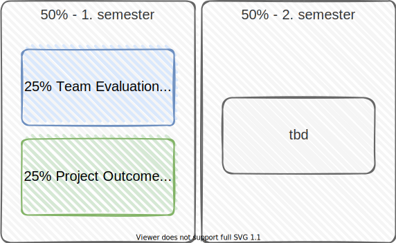
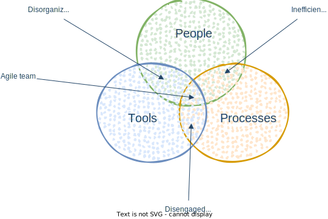

<!-- markdownlint-disable MD025 MD045 MD012 MD024 MD026 -->

# Project Management 1

## Lesson 02 - Project Liftoff

---
<!-- _backgroundColor: lightblue -->

# Practice - Project Quotes Exploration

1. Form groups (of 4..5)
2. Go to the worksheet (online) or the table (in-presence)
3. Pick one of the quotes (⏲️10s, don't overthink)
4. Work in the group to understand (write sticky notes)  ⏲️7min
   1. **What**'s behind this quote?
   2. **So, what** else do you see here?
   3. **Now, what** what's the paradox, the both sides of the story?
5. Come back to the whole group, share the quote and the paradox behind it. ⏲️3x1min

---

# Today's session

1. Mental Models of the Week
   1. PairSensing, One-Page Universe
2. Project Liftoff
   1. Project Canvas
   2. Our Project
3. And more
   1. Tool Nugget
   2. More Material

---

# Reminder

* Energizer Crew
* Team Agreements ➡️ Checker Crew

---

# How is your learning progress evaluated?

---
<!-- _backgroundColor: Wheat -->

# Mental Models

Mental models are how we understand the world. Not only do **they shape what we think and how we understand** but they shape the connections and opportunities that we see.

A mental model is simply **a representation of how something works**. We cannot keep all of the details of the world in our brains, so we use models to **simplify the complex into understandable and organizable chunks**.

<!--
_footer: Source: [Mental Models: The Best Way to Make Intelligent Decisions (~100 Models Explained)](https://fs.blog/mental-models/#what_are_mental_models)
-->

---

<!-- _backgroundColor: Wheat -->

# Mental Models of the Week

* **Shu-Ha-Ri** - a Model that describes mastery paths
* **Circle of Influence** - there is more we can influence than we think we can
* **The Growth Mindset** - always stay open, there is no finish with learning
* **People/Process/Technology** - how it all fits together to make projects successful
* **All Models Are Wrong, Some Are Useful** - be aware that models are simplifications of reality

---
<!-- _backgroundColor: Wheat -->

# Mental Model - Shu-Ha-Ri

---
<!-- _backgroundColor: Wheat -->

# Mental Model - Circle of Influence

---
<!-- _backgroundColor: Wheat -->

# Mental Model - Growth Mindset

<!--
_footer: 'Source: [How you can benefit from a growth mindset](https://www.atlassian.com/blog/inside-atlassian/growth-mindset)'
-->

---
<!-- _backgroundColor: Wheat -->

# Mental Model - People/Processes/Tools

---
<!-- _backgroundColor: Wheat -->

# All Models Are Wrong, Some Are Useful

George E.P. Box

---

# How to share knowledge (aka mental models)?

## Create a One-Pager using PairSensing

The one-pager contains a tweetable summary, a concise description, a compilation of further reading and an illustration of the topic.
Using the PairSensing workshop format, all of this will exist after one hour.

<!--
_footer: Source: [One-Pagers: A tool to quickly summarize a topic](http://urskr.blogspot.com/2014/03/one-pagers-tool-to-quickly-summarize.html)
-->

---

<!--
_footer: Source: [Agile Planet - Fabian Schiller](https://leanpub.com/agileplanet)
-->

---

<!-- _backgroundColor: Lightblue-->
# Practice - Start with PairSensing (the Tweet part)

1. Go together in pairs
2. Create Tweets (140chars)
   1. Go to our worksheet, find your frame (online). Grab a post-it.
   2. Scan the shared material for the topic. ⏲️5min
   3. Individually, write a tweetable text on the topic. Share afterwards. ⏲️3min
   4. Repeat. ⏲️3min
   5. In ⏲️4min, agree on a single tweet text or compile one. Write it down on a sticky note.
3. Share your tweet with the group in ⏲️30s.

---

# Project Liftoff

## What is it, Why are we doing it

When projects start, a liftoff generates the momentum teams need to overcome the inertia presented by lack of common purpose, unclear communication channels, undefined working relationships, and other areas of ambiguity. A liftoff also provides the positive force that moves a project toward its destination — successful delivery.

## How are we doing it

Today: with the help of a Project Canvas. Aha! 👀

<!--
_footer: Source: [Project Liftoff](https://www.projectmanagement.com/articles/270032/Project-Liftoff#:~:text=When%20projects%20start%2C%20a%20liftoff,and%20other%20areas%20of%20ambiguity.)
-->
---

# Visual Management ➡️ Project Canvas

## [Visual Management](https://txm.com/visual-management/)

## [Canvases - Visual Thinking Templates](http://masterfacilitator.com/canvas-collection/)

## Project Canvas - (yet another) mental model 😁

---

# Team

* Who and what skills are involved?
* What is everybody’s role?
* Is there room for self-responsibility?  yes ✅
* How is the motivation within the team?

---
<!-- _backgroundColor: lightblue -->

# Practice - Team Selection

- use the room to form teams of 6+-2
  - with a harmonized mix of individuals and experience
- document in the ➡️ worksheet

---

# Processes & Tools

* Which approach was selected?
* What are the set standards/methods/tools?

---

<!-- _backgroundColor: lightblue -->
# Practice - Tools

➡️ worksheet

* ⏲️7min to gain expertise
* ⏲️10min to setup

1. Everyone has setup a basic tool chain
   1. Git, IntelliJ, markdown editor, diagrams.net
   2. Git, vscode, markdown editor, diagrams.net
2. Everyone has the [repository](https://github.com/dhbw-ka-pm/tinf22b6-mentalmodels-for-teams.git) pulled from Github.
3. Done.

---

# Communication & Transparency

* How will status inquiries and reporting be handled?
* **What communicational tools are being used?**
* How is the perception of the project externally an internally?

---

<!-- _backgroundColor: LightPink -->

# Tool Nugget

* [The Pomodoro® Technique](https://en.wikipedia.org/wiki/Pomodoro_Technique)
* [Pomodone App (Web, Desktop, Mobile)](https://pomodoneapp.com/pomodoro-timer-for-students.html)
  * [Pomodoro Timer for GitHub Issues](https://pomodoneapp.com/pomodoro-timer-for-github-issues.html)
* [Pomodoro for vscode](https://marketplace.visualstudio.com/items?itemName=cosminalco.pomodoro)

---

<!-- _backgroundColor: LightPink -->

# Additional Material

[Your colorful bag of PM candies (and other stuff...) from Lesson 01](../../lesson%20101%20-%20orientation/material/lesson101-material.md)
[More colorful candies - from Lesson 02](../material/lesson102-material.md)

---
<!-- backgroundColor:  LightGreen -->
# Practices we've used

* **[What, So what, now what](https://www.liberatingstructures.com/9-what-so-what-now-what-w/)** - Sensemaking in a group
* **[PairSensing, One-Pagers](http://urskr.blogspot.com/2014/03/one-pagers-tool-to-quickly-summarize.html)** - A tool to quickly summarize a topic
* **[Project Liftoff](https://pragprog.com/titles/liftoff/liftoff-second-edition/)** - Building better beginnings through Agile Chartering
* **[Project Canvas](https://www.openpm.info/display/openPM/Canvas)** - walk through a skeleton of topics/questions to achieve a "good enough" outcome

---

<!-- _backgroundColor: lightblue -->
# Check out

1. Popup round
1. One ad-hoc word about today's session
1. Repeat until ...
1. 🙏

---
<!-- _backgroundColor: lightblue -->

# Feedback

* My feedback to you.
* Your feedback to me

