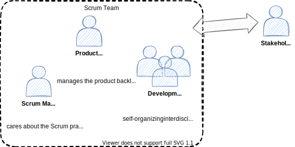

<!-- markdownlint-disable MD025 MD045 MD012 MD024 MD026 -->

# Project Management 1

## Lesson 06 - Planning, Roles in Scrum

---
<!-- _backgroundColor: lightblue -->

# Practice - Roles/Jobs/Functions in scope of PM

1. Go to the worksheet.
2. Take ⏲️3min to note down all roles/jobs/functions that come to your mind in the field of (Agile) Project Management (your company, your own professional experience etc.).

---

# Today's session

0. What happened since last week...
1. Planning (1 & 2)
2. Roles in Scrum
3. Role Selection

---

# Sprint Planning

Sprint Planning initiates the Sprint by laying out the work to be performed for the Sprint. This resulting plan is created by the collaborative work of the entire Scrum Team.

The Product Owner ensures that attendees are prepared to discuss the most important Product Backlog items and how they map to the Product Goal.

The Scrum Team may also invite other people to attend Sprint Planning to provide advice.

---

# Sprint Planning

* Planning 1
  * **Why** is this Sprint valuable?
  * **What** can be Done this Sprint?
* Planning 2
  * **How** will the chosen work get done?

---
<!-- _backgroundColor: lightBlue -->

# Practice - Planning

* Let's go to the worksheet

---

# Scrum Roles

---

## The Scrum Master Role

Team role responsible for ensuring the team lives agile values and principles and follows the processes and practices that the team agreed they would use.

The **responsibilities** of this role include:

* Clearing obstacles
* Establishing an environment where the team can be effective
* Addressing team dynamics
* Ensuring a good relationship between the team and product owner as well as others outside the team
* Protecting the team from outside interruptions and distractions.
* Support the team making coordination with other teams efficient and effective

The role does not generally have any actual authority. People filling this role have to lead from a position of influence, often taking a servant-leadership stance.

---
<!-- _backgroundColor: lightblue -->

## Practice - Scrum Master Role Selection

* **Nomination** - moderator asks the team whether everyone has understood the description of the role – if necessary, clarify relevant questions. Then everyone takes a piece of paper and a pencil and covertly writes down a nomination, which they think should fill in this role. Then listen to nominations and arguments for them.
* **What else to know?** - After completing the round, collect relevant and important information. no discussions – only information is needed now.
* **(Re-)Nomination** - Opportunity to reconsider nominations, to change it, or to retain it. Everybody reads out their nomination again and presents the reasons for changing something or for sticking with it.
* **Nominees** - Discuss objections against nominees, find solutions, possibly drop nominations. Remaining nominees decide who fits best.
* **🎉Celebrate your result!**

---

<!-- _backgroundColor: LightPink -->

# Additional Material

---

<!-- _backgroundColor:  LightGreen -->
# Practices we've used

* Sprint Planning 1 (Why, what)
* Sprint Planning 2 (How)
* [Sociocracy 3.0 - Role Selection](https://patterns.sociocracy30.org/role-selection.html)

---
<!-- _backgroundColor: lightblue -->
# Until next session

* Our sprint 02 has started Let's scrum!
* Feel invited to take a look in the material of the last few sessions.
* You may spend some time to familiarize with some more mental models (expect them to be in the next sprint).
* My Discord is open

---

<!-- _backgroundColor: lightblue -->
# Check out

What's my #1 takeaway from today?

➡️ worksheet

---
<!-- _backgroundColor: lightblue -->

# Feedback

* My feedback to you.
* [Your feedback to me](https://moodle.dhbw.de/mod/feedback/view.php?id=176499)

