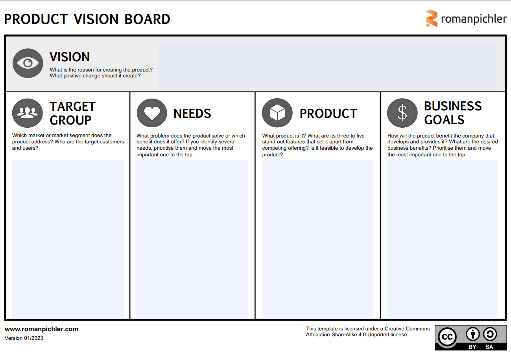

<!-- markdownlint-disable MD025 MD045 MD012 MD024 MD026 -->

<!-- _backgroundColor: lightblue -->

## Check-in

* Find a partner.
  * For ⏲️4min elaborate on:
    * Were there moments when you were reminded on the PM course during the practice phase? If yes, what was the connnection?
    * Which new PM questions came up?
* Find a new partner.
  * For ⏲️4min elaborate on:
    * What did you hear in the previous round?
    * What are your insights? Any commonalities, differences?

---

## Today

> In the next weeks we will shape a product, from product discovery to delivery. We will work in 2..3 teams.

1. Product Proposals
2. Team Selection, rough first team agreements
3. First Project Vision

---

## Before we begin, some clarification

Agile Project Management Course ↔️ A multi product organization

---

---

---
<!-- _backgroundColor: lightblue -->

## What topics & technologies were covered in web engineering course?

* Think for yourself for ⏲️1min
* Go into pairs, consolidate the list for ⏲️2min
* Merge into a group of four from the pairs, consolidate the list for ⏲️4min
* Let's see what we have all together
   
---

<!-- _backgroundColor: lightblue -->

## Product Proposals

1. Individually, read through the "Web Engineering Topics"
2. Consider: What if we could make an app/page that...
3. Those of you, who wants to make a call...
   1. What would be you concrete product idea based on the topics collected? (⏲️4min) (pairs are fine as well)
   2. Find a Catchy name that helps to "sell" the idea
   3. Who would use it?
   4. ...to solve what?
   5. What would make it unique?
4. Pitch the product idea (⏲️1min each)
5. Round: Questions for understanding

---
<!-- _backgroundColor: lightblue -->

## Team Selection

1. Let's build maximum 3 teams around the product proposals ...by constellation in the room
2. Come together as a team
   1. In the groups, share quick considerations (⏲️7min) on
      1. product idea (next level) - "What if..."
      2. expertise (domain and technical) that might be needed
3. Double-check team composition
4. Create initial (good-enough) team agreements using 1-2-All (⏲️10min)
5. Celebrate 🎉

---

## Shape a first Product Vision

---

<!-- _backgroundColor:  LightGreen -->

## Practices we've used

1. Check-in: [Impromptu Networking](https://www.liberatingstructures.com/2-impromptu-networking/)
2. Product Proposals, [Team Self Selection](https://www.agilealliance.org/resources/experience-reports/creating-how-self-selection-lets-people-excel/)
3. [Team Agreements (Management 3.0)](https://management30.com/blog/team-agreements/)
4. [Liberating Structures - 1-2-4-All](https://www.liberatingstructures.com/1-1-2-4-all/)
5. [Project Vision (Roman Pichler)](https://www.romanpichler.com/blog/the-product-vision-board/)

---

## Expectations until next week...

1. Use our [shared Wiki](https://github.com/dhbw-mos-pm/tinfo23-sem2-shared/wiki) to do - per team:
   1. The product idea/proposal/vision, ideally as Canvas (you may use draw.io)
   2. Teams and team members
2. Setup Github teams and repositories -> Admins (naming scheme helps)
3. In your team wikis: Shape a team agreement, canvas or custom)

> We use this also as a communication back to "Web Engineering"

---

## Check-out...

<!-- _backgroundColor: lightblue -->

* What is my superhero power pose?

.png)
