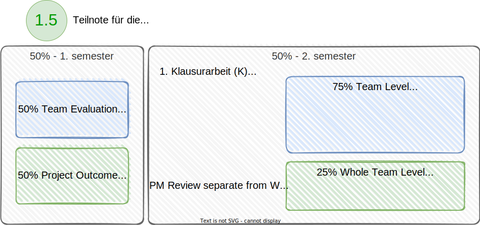
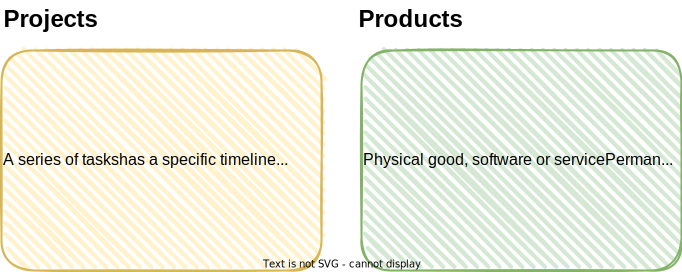
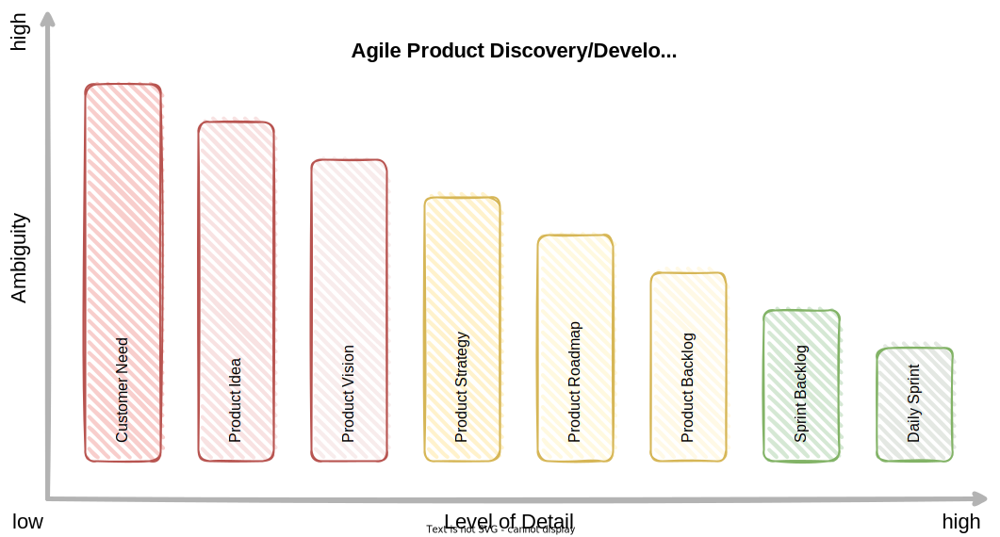

<!-- markdownlint-disable MD025 MD045 MD012 MD024 MD026 -->

<!-- _backgroundColor: lightblue -->

## Check-in

* Go into pairs with a "stranger". Share the answer to the following question.
* What is your most pressing question of the day?

---

## Today

1. Logistics
   1. What's the state? Team Agreements, Product Ideas
   2. Evaluation
2. Some Context - from Project to Product
3. Setup
   1. Setup Roles (Scrum Master, Product Owner)
   2. Setup Tools
   3. Product Strategy

---

## What's the state?

* Team, Repo, (initial) team agreement, (initial) product vision, Github team

1. borrowbuddy
2. pedigree
3. gym-finder
4. travelinsights
5. ?
6. ?

---

## Evaluating your Learning Progress




See [Prüfungsordnung DHBW](https://www.dhbw-vs.de/files/content/02_LEHRE/Lehrbeauftragte/Pruefungsordnung_JG2009_01.pdf)

---

## From Projects to Products



---

## Product Discovery - Mental Model


---

## Agile Product Discovery / Development Process



---
<!-- _backgroundColor: lightblue -->

## Role Selection - Product Owner

---
<!-- _backgroundColor: lightblue -->

## Role Selection - Scrum Master

---

## Development Team

**Developers** are the people in the Scrum Team that are committed to creating any aspect of a usable Increment each Sprint.

The specific skills needed by the Developers are often broad and will vary with the domain of work. However, the Developers are always accountable for:

1. Creating a plan for the Sprint, the Sprint Backlog;
2. Instilling quality by adhering to a Definition of Done;
3. Adapting their plan each day toward the Sprint Goal; and,
4. Holding each other accountable as professionals.

---

## Tools Setup

* Github
   * Product Repositories
   * Teams Setup (in shared wiki and as Github team)
   * (Roles Documentation)
   * (Discussions?)
   * (Use Github Projects and setup board)
* (Miro access for Scrum Masters?)
* (Discord channels?)

---

## Extend Team Agreement

Add the tools your team is using for

* code artifacts
* conversation
* coordination
* documentation
* collaboration

Add notes how to use the tools as needed.

---

## Product Vision Statement

```md
For **[our target customer]**,
who **[customer’s need]**,
the **[product]** is a **[product category or description]**
that **[unique benefits and selling points]**.

Unlike **[competitors or current methods]**,
our product **[main differentiators]**.
```

See [How To Create a Compelling Product Vision That Will Drive Your Team](https://uxstudioteam.com/ux-blog/product-vision/)

---
<!-- _backgroundColor:  LightGreen -->

## Practices we've used

* [Sociocracy 3.0 - Role Selection](https://patterns.sociocracy30.org/role-selection.html)
* [Product Vision Statement](https://uxstudioteam.com/ux-blog/product-vision/)
* 

---

## Expectations until next week

* Complete Product idea, teams and team roles in **shared wiki**
* Team agreements in **team wikis**
* Product Vision Statement documented in **team wikis**

---
<!-- _backgroundColor: lightblue -->

## Check-out

* In your teams: Make a round.
* Please share in one word how you are feeling now, at the end of this day.

