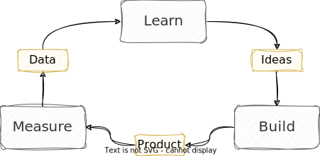
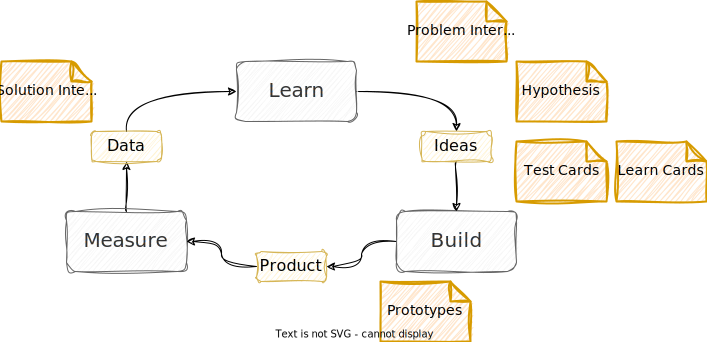

<!-- markdownlint-disable MD025 MD045 MD012 MD024 MD026 -->

# Today

1. Intro Round - SM
   1. PO and DevTeam: Recap Scrum Artifacts, Scrum Ceremonies
2. Intro Round - PO
   1. SM and DevTeam: Recap XP Practices, Initial DoD
3. Some Aspects about Product Discovery
4. Intro Round - DevTeam/All
5. Sprint Planning for first Sprint (25.05. - 14.06.)

---
<!-- _backgroundColor: lightblue -->

# Intro Round - SMs (⏲️ 12min)

1. All Team SMs, please work with me
2. Meanwhile, PO and DevTeam
   1. Recap [Scrum Artifacts](https://github.com/thomykay/dhbw-projectmanagement1/blob/main/lesson-07%20-%20scrum/graphics/scrum-artifacts.drawio.svg), [Ceremonies](https://github.com/thomykay/dhbw-projectmanagement1/blob/main/lesson-05%20-%20review%20retro/graphics/scrum%20-%20sprint%20rituals.drawio.svg)
   2. Where is your playing field....?

---
<!-- _backgroundColor: lightblue -->

# Intro Round - PO

1. All Team POs, work with me
2. Meanwhile, SM and DevTeam
   1. Recap [XP Practices](https://github.com/thomykay/dhbw-projectmanagement1/blob/main/lesson-10%20-%20roundup/graphics/xp-practices.drawio.svg)
   2. Recap Definition of Done
   3. Build your initial DoD

---

# Some Aspects about Product Discovery

1. What should be the focus for the first sprint?
2. Types of (Customer) Interviews
3. Invalidate Hypotheses
4. (Some) Types of Prototypes

---

---

---

---

# Problem Interviews

* See [Problem Interview Guide](https://debane.org/franck/problem-interview-guide-for-lean-startup-experience/)

---

# Solution Interviews  

* [Interviewing customers to explore problems and solutions](https://marcabraham.com/2015/06/24/interviewing-customers-to-explore-problems-and-solutions/)

---

# Hypothesis Prioritization Canvas

[Hypothesis Prioritization Canvas](https://jeffgothelf.com/blog/the-hypothesis-prioritization-canvas/)

---

# Test Cards

[Validate Your Ideas with the Test Card](https://www.strategyzer.com/blog/posts/2015/3/5/validate-your-ideas-with-the-test-card)

---

# Learning Cards

[Capture (Customer) Insights and Actions with the Learning Card](https://www.strategyzer.com/blog/posts/2015/3/9/capture-customer-insights-and-actions-with-the-learning-card)

---

# Building Prototypes

[5 Common Low-Fidelity Prototypes and Their Best Practices](https://www.interaction-design.org/literature/article/prototyping-learn-eight-common-methods-and-best-practices)

---

# Be like startup 😁

* [Maximizing the amount of work not done](https://www.leadingagile.com/2019/03/maximizing-the-amount-of-work-not-done/)
* Fake it till you make it
* Act as If You Have No Engineers - Run your experiments before you write a line of code.

---
<!-- _backgroundColor: lightblue -->

# Intro Round - DevTeam, All (⏲️12min)

* What should be the focus for the first sprint?
* What kind of user interviews could we run?
* How could we invalidate our hypotheses?
* What prototypes could we build and use?
  
---

<!-- _backgroundColor: lightblue -->

# Sprint Planning (⏲️12min)

* What are potential **users/customers** you could speak to?
* Which **tests/experiments** are fast and cheap to (in)validate your hypotheses?
* What could be a way to **demonstrate potential value** to potential users at the end of the sprint?

* Shape the initial **Product Backlog** and the **Sprint Backlog**. What's your **Sprint Goal**?
* Cope with the current level of ambiguity, dance with it
* Plan to go through **Learn/Build/Measure** multiple times in the sprint

---

# Expectations till next week

* Demonstrate to be able to come from planning to learning➡️doing as a team
* Find into your roles and how to interact.
* Make use of process(es) and tools (ie. Backlog refinement)

* Each team: Share 3min about your first steps in the sprint

---
<!-- _backgroundColor: lightblue -->

# Check-out