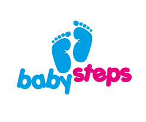

<!-- markdownlint-disable MD025 MD045 MD012 MD024 MD026 -->

## Today

1. Each team: Share 3min about your first steps in the sprint
2. Some Theory
   1. Personas
   2. Epics & User Stories
   3. Stories in Detail, Examples
3. Some Practice (Backlog Refinement)
   1. Your first Persona
   2. Your first (?) Epic... and respective Stories
4. Each team: Share 3min the outcome of your backlog refinement
5. Evaluation Feedback
6. Checkout

---
<!-- _backgroundColor: lightblue -->

## Your first steps in the sprint

1. Go into teams and clarify what's worth sharing. ⏲️5min
   1. Categories: Tools & Technologies, Principles & Practices, People & Collaboration
   2. Experiences: We were successful, we struggled, we tried, we failed...
2. Share with the whole group. ⏲️3min per team.
---

## User Persona

User Persona is a **detailed real or hypothetical description of a typical end-user** of the product the team is developing.

Personas usually take the form of a written document with a photo, name, profession, style of living, and other important details.

See [Persona@Agile Academy](https://www.agile-academy.com/en/agile-dictionary/persona)

---

## Persona Canvas

See [10 Tips For Creating Agile Personas](https://www.romanpichler.com/blog/10-tips-agile-personas/)

---

## Epics & Stories

* **Epic** - a big, sketchy, coarse-grained story

* **User Story** - describes how a customer or user employs the product; it is told from the user’s perspective

See [10 Tips For Writing Good User Stories](https://www.romanpichler.com/blog/10-tips-writing-good-user-stories/)

---

## Good Stories

1. Users Come First
1. Use Personas to Discover the Right Stories
1. Create Stories Collaboratively
1. Keep your Stories Simple and Concise
1. Start with Epics
1. Refine the Stories until They are Ready
1. Add Acceptance Criteria
1. Use (Paper) Cards
1. Keep your Stories Visible and Accessible
1. Don’t Solely Rely on User Stories (use Story Maps, User Journeys etc.)

See [Agile Scenarios and Storyboards](https://www.romanpichler.com/blog/agile-scenarios-and-storyboards/)

---

## Stories - Examples

---

## Stories - more Examples

---

## Stories - more Examples explained

1. **Background** - Why are we doing this
1. **Acceptance Criteria** - How do we know it's done
1. **Open Questions** - What do we need to learn/decide?
1. **Implementation Hints** - Considerations for how to tackle this

---

## ~~Stories~~ - even more Examples

See [Replacing The User Story With The Job Story](https://jtbd.info/replacing-the-user-story-with-the-job-story-af7cdee10c27)

---
<!-- _backgroundColor: lightblue -->

## Practice - Your Backlog Refinement ⏲️30min

1. Build your primary persona
2. Shape (at least) one core epic and it's detailed user stories
3. Last 5min: Share the outcome with a delegate from another team

### See

* [The Product Backlog Refinement Steps](https://www.romanpichler.com/blog/the-product-backlog-refinement-steps/)
* [Refining the Product Backlog](https://www.romanpichler.com/blog/refining-the-product-backlog/)

---

## Evaluation Feedback

---

## Expectations till next week

* **Go out of the building**: Understand your users, do user interviews
    * Who are the people you can talk to?
* With these insights, build hypotheses
* With these hypotheses
    * shape personas (your primary persona)
    * shape epics -> stories
* Fill your product backlog (quality, not quantity)
* Make your work tangible: persona template, hypothesis, test cards, epics/stories
