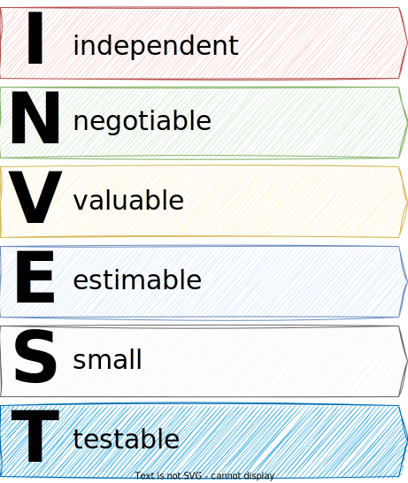
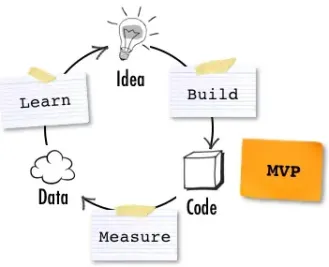
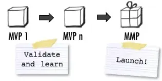

<!-- markdownlint-disable MD025 MD045 MD012 MD024 MD026 -->

## Today

1. Looking over each others shoulders
2. Improving things

---

## INVEST

See also [What is the Scrum I-N-V-E-S-T​ Criteria?](https://www.linkedin.com/pulse/what-scrum-invest-criteria-ryan-hart-mba/)

---

## User Story Mapping

See also [Story Map Concepts](https://www.jpattonassociates.com/wp-content/uploads/2015/03/story_mapping.pdf)

---

## User Story Mapping - Example

See also [The User Story Mapping Game](https://medium.com/the-liberators/the-user-story-mapping-game-3500f282dbbb)

---

## Minimum Viable Product

The minimum viable product (MVP) is a **learning vehicle**. It allows you to **test an idea** by exposing an early version of your product to the target users and customers, to collect the relevant data, and to learn from it.

See also [The Minimum Viable Product and the Minimal Marketable Product](https://www.romanpichler.com/blog/minimum-viable-product-and-minimal-marketable-product/)

---

## Minimum Marketable Product

The minimum marktetable product (MMP) describes the product with the **smallest possible feature set** that addresses the needs of the initial users (innovators and early adopters), and can hence be marketed and/or sold. The MMP is a tool to **reduce time-to-market**.

See also [The Minimum Viable Product and the Minimal Marketable Product](https://www.romanpichler.com/blog/minimum-viable-product-and-minimal-marketable-product/)

---
<!-- _backgroundColor: lightblue -->

## Practice - What can you learn from it? ⏲️15min

1. Check your **User Stories** against the INVEST criteria.  What is needed to improve them "just a little bit (aka baby steps)"?
2. (How) can **User Story Mapping** help to better understand your product and your approach to build it?
3. How should **your first MVP** look like? What ideas (hypotheses) should be tested with it?

---

## What does it mean to be **READY**?

1. Defined clearly enough that all team members understand what must be done
   * Includes team-developed tasking, if needed
   * Assume some ongoing discussion to refine, coordinate and clarify
2. Includes clear statement of resulting business value that allows the Product Owner to prioritize
3. Includes any required enabling specs, wire frames, etc.
4. Fully meet INVEST criteria for user stories
   * Estimated and sized to complete easily within one sprint
5. Free from external dependencies
   * I.e. there is nothing beyond the team's control that must be done
first in order to complete the story

See also [Definition of Ready@Scrum.inc](https://www.scruminc.com/definition-of-ready/)

---

## What does it mean to be **DONE**?

1. "Definition of Done" (DoD) decided on beforehand - along with acceptance tests
    * DoD can be standard across a group of common stories, or defined specifically for unique ones
1. Done means the feature has been developed, tested AND meets all required acceptance tests
1. Ideally, Done means the feature could be shipped to a customer
1. Product Owner officially "Accepts" Done features back from Team at the Sprint Review meeting

---

## Sprint Goals

> A sprint goal describes the purpose of a sprint. It provides a shared objective, and states why it’s worthwhile undertaking the sprint.

See also [Creating Effective Sprint Goals](https://www.romanpichler.com/blog/effective-sprint-goals)

---
<!-- _backgroundColor: lightblue -->

## Practice - What can you learn from it? ⏲️15min

1. Check your **Definition of Done**. (How) does it help the team to deliver great quality?
2. Consider to work with a **Definition of Ready**. What would be the minimum, how would you work with it?
3. If not yet done, try to shape a **Sprint Goal** that is specific, measurable, achievable but ambitious.

---

# Looking at...

* Product Backlogs
* Sprint Backlogs
* Sprint Boards

---
<!-- _backgroundColor: lightblue -->

## Practice - What can you learn from it? ⏲️15min

1. Steal from others (take only the best) in terms of
   * using labels
   * using sprints
   * using epics
   * project views
1. Massage your product backlog structure to become 1..2 steps better

---

## Expectations till next week

* **Finish the sprint**, work to achieve your goals to (in)validate your ideas, learn and (when appropriate) build a first working prototype
* Next time
  * We'll do a **Sprint Review**, so have your artifacts (persona, interview results, learnings, prototypes) ready
  * We'll do a **Retrospective**. @scrummasters: I will work with you [here](https://github.com/dhbw-ka-pm/tinf22b6-shared/discussions/categories/scrum-masters) to prepare.
