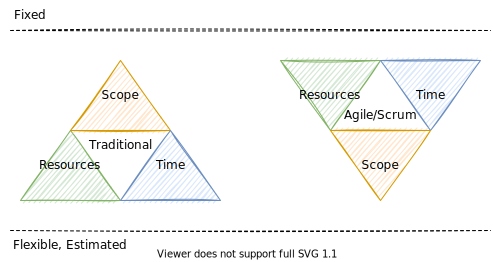
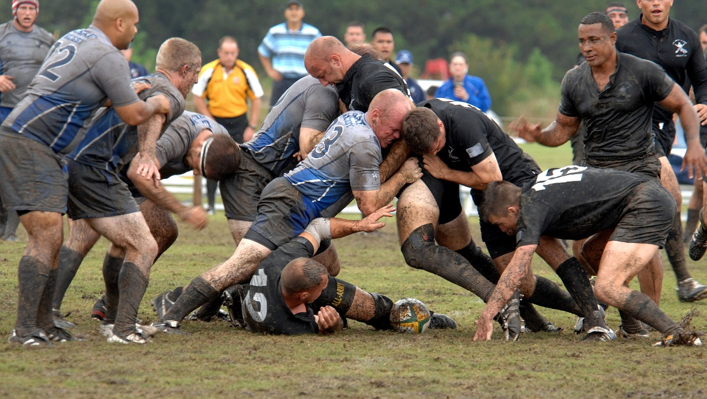

<!-- markdownlint-disable MD025 MD045 MD012 MD024 MD026 -->

# Lesson 207 - Sprint Planning

---

## Today

1. Why are we doing sprints, after all?
1. Recap: Sprint Planning
1. Sprint Planning
   1. Planning 1
   2. Planning 2

---

## Why are we doing sprints, after all?

---

## The Iron Triangle of Planning

See also [Iron triangle project management and agile](https://www.atlassian.com/agile/agile-at-scale/agile-iron-triangle)

---

## Recap: The Learn/Build/Measure Loop

---

## Recap: Wolkenmetapher

<!--
_footer: 'Source: [Wolkenmetapher, Bernd Oestereich, Claudia Schröder](https://kollegiale-fuehrung.de/download-material/?download=32d2a638b7c48255b367075daafb22fd)'
-->

---

## Recap: Double Diamond

---

## Cynefin

* [Cynefin framework@wikipedia](https://en.wikipedia.org/wiki/Cynefin_framework)
* [Understanding the Cynefin framework – a basic intro](https://www.everydaykanban.com/2013/09/29/understanding-the-cynefin-framework/)

---

## More Cynefin

* [Cynefin Framework and its impact in today’s software industry](https://5u3it.medium.com/cynefin-framework-and-its-impact-in-todays-software-industry-d64caa50f407)

---

## Even More Cynefin

<!--
_footer: 'Source: [Cynefin - can Vige make sense in different domain?](https://www.vige.se/blog/2020/6/20/cynefinvige)'
-->

---

## Stacey Matrix

<!--
_footer: 'Source: [Contextless Scrum: A Principles or Rules Driven Framework?](https://www.scrum.org/resources/blog/contextless-scrum-principles-or-rules-driven-framework)'
-->

---

## Sprint Planning

After a successful Sprint Planning:

* the product owner and the development team agree on the **sprint goal** (outcome)
* and have formed the **Sprint Backlog**. The Sprint Backlog contains all Product Backlog Items that must be implemented in the Sprint to achieve the Sprint Goal (output).

---

## Viability, Desirability, Feasibility

* [Desirability, Feasibility, Viability: The Sweet Spot for Innovation](https://medium.com/innovation-sweet-spot/desirability-feasibility-viability-the-sweet-spot-for-innovation-d7946de2183c)

---

## Sprint Planning - Preparation

1. PO has defined a **Sprint Goal** (Outcome) and selected the associated Product Backlog Items (PBIs).
2. The selected PBIs were formulated in sufficient detail - preferably in collaboration with the development team, e.g. as part of a Product Backlog Refinement.
3. The selected PBIs have been put in an order according to which the development team will work on them. This takes into account technical dependencies.
4. The team has a **DoD**.
5. The **capacity** of the team for the next Sprint has been determined, e.g., taking into account the average velocity of the last Sprints, planned vacations.

---

## Sprint Planning - Process

1. PO presents the sprint goal and the associated PBIs and answers comprehension questions from the team. The Sprint Goal should be documented on the Sprint Backlog in a way that is easy to read for all team members.
2. (Estimation)
3. The team makes a prediction to the product owner and stakeholders about what PBIs it will deliver at the end of the sprint according to the collaboratively written DoD. In this way, the Sprint Backlog is formed.

---

## Sprint Planning - Process

1. Sprint Planning 1 deals with the question:
    * **What** do we want to tackle in the upcoming sprint?
2. Sprint Planning 2 deals with the question:
    * **How** do we want to tackle it?

See [Sprint Planning Meeting](https://www.agile-academy.com/en/scrum-master/sprint-planning-meeting/)

---
<!-- _backgroundColor: lightblue -->

## Practice - Sprint Planning ⏲️40min

---

## Expectations till next week

* **Start the sprint**, work to achieve your goals to (in)validate your ideas, learn and iterate your product
* Don't forget your 1..2 **improvement issues**
* Thomas: Evaluation Feedback
* What's your wicked question in terms of developing products?
