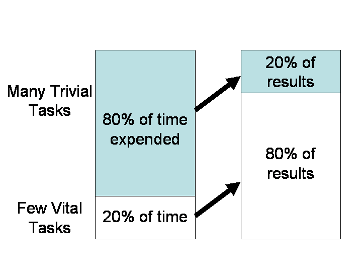
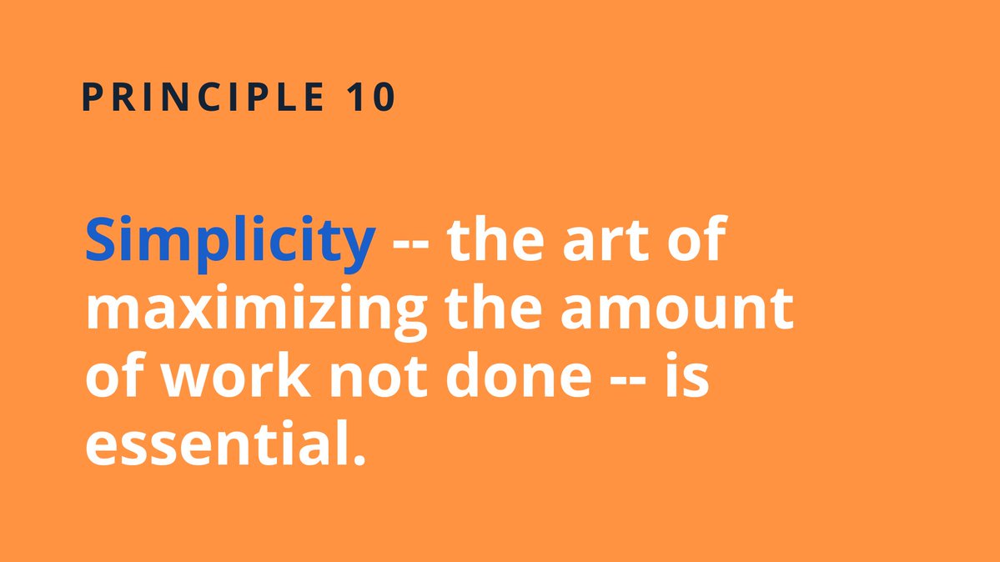

<!-- markdownlint-disable MD025 MD045 MD012 MD024 MD026 -->

# Lesson 209 - Sprint Review, Planning

---

## Today

1. Sprint Review with all Stakeholders (⏲️8min per team)
2. Brief Feedback
3. Some inspirations for sprint 3
4. Sprint Planning in Teams

---
<!-- _backgroundColor: lightblue -->

## Practice - Sprint #2 Review

1. ⏲️8min per team
2. Questions (to the team)
   1. What did you achieve in the recent sprint?
   2. What's your favorite with the current state of the product?
   3. If you could change/add one thing, what would it be?

---
## Celebrate

---

## Feedback

---

## We're approaching the last sprint...

---

## Pareto Principle

---

---

---

## Recap - our Mental Models for Teams...

---

<!-- _backgroundColor: lightblue -->

## Practice - Sprint Planning ⏲️20min

1. What do we need to **understand** about these backlog items in order to fully commit to getting them done in the upcoming sprint?
2. **How much** of the product backlog do we think we can complete in the upcoming sprint?
3. Do we need more **clarification** on this feature?

---

## Recap - Learning Process Evaluation

---

## Expectations till next week

* Have a clear goal for the last sprint
    * Converge: What's the maximal value you can achieve with minimum effort?

* Start the sprint with focus on the next sprint review
    * WebEngineering - use of web technologies incl. HTML, CSS, XML/XSLT and more
    * PM - Product Discovery/Delivery approach, team dynamics, coordination, artifacts (Persona, Product Vision, Stories, Backlog etc.)
