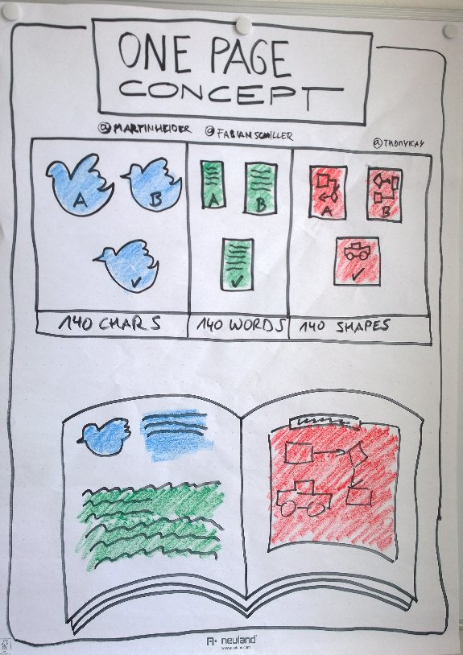

<!-- markdownlint-disable MD025 MD045 MD012 MD024 MD026 -->

# Project Management 1

## Lesson 03 - Liftoff and Planning

---
<!-- _backgroundColor: lightblue -->

# Practice - Let's arrive

* Some way of arriving

## OR

* Has the energizer team something for us?

---

# Reminder

➡️ worksheet

---

# Today's session

1. Liftoff
   1. Team Selection
   2. Clarify Communication Tools
   3. Celebrate
2. OK, where's the plan?
   1. Our product backlog
   2. Planning our 1st iteration
   3. Give it a goal!
3. Work - Create Knowledge Value (in our Tooling)
4. And more
   1. Mental Model(s) of the Week
   2. Tool Nugget
   3. More Material

---

# Recap - the One-Pager-Format

---

# One-Pager-Format

---

# Into Liftoff...

➡️ worksheet

---

<!-- _backgroundColor: Wheat -->

# Mental Models of the Week

* Hand, Head, Heart

---

<!-- _backgroundColor: LightPink -->

# Tool Nugget

* [Todoist](https://todoist.com/) - get yourself organized
* [Pomodone and Todoist](https://todoist.com/help/articles/use-pomodone-with-todoist)
* [Getting Things Done (GTD)](https://todoist.com/productivity-methods/getting-things-done)

---

<!-- _backgroundColor: LightPink -->

# Additional Material

[Grab the fruity candies](lesson03-material.md)

---
<!-- backgroundColor:  LightGreen -->
# Practices we've used

* Team Selection
* Sprint Planning
* Sprint Goal

---

<!-- _backgroundColor: lightblue -->
# Check out

---
<!-- _backgroundColor: lightblue -->

# Feedback

* My feedback to you.
* Your feedback to me

