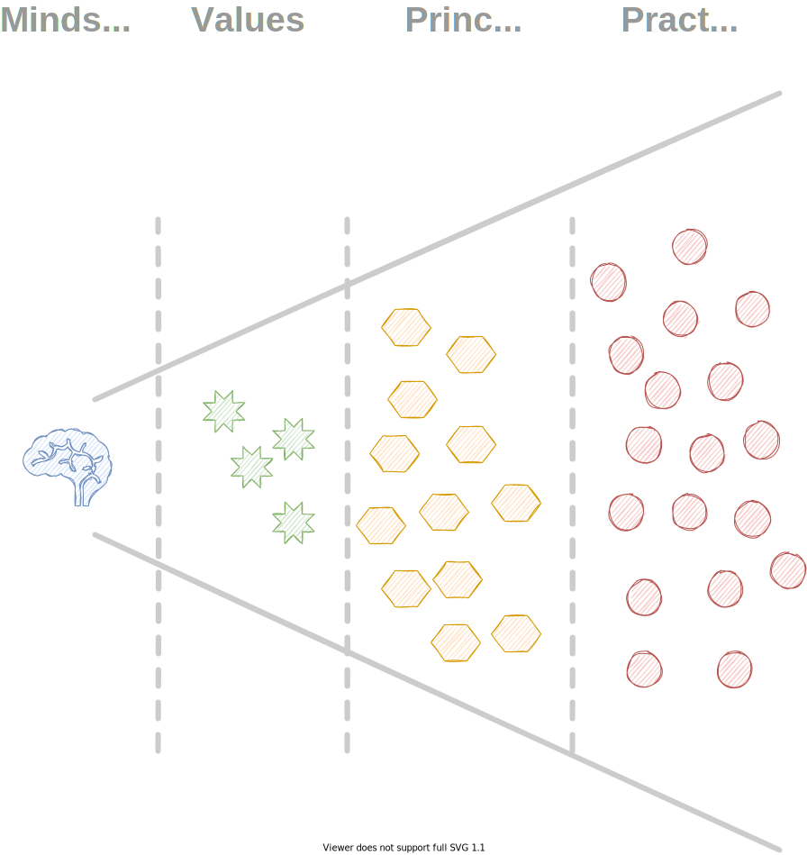

<!-- markdownlint-disable MD025 MD045 MD012 MD024 MD026 -->

# Project Management 1

## Lesson Lesson 04 - Agile Intro

---

# Today's session

1. Gain expertise in Tooling
   1. Some notes about our recent project activities
2. Agile Intro
   1. Values, Principles, Practices
   2. Agile - From Mindset to Practices
3. And more...
   1. Mental Models
   2. Additional Material
   3. Closing

---
<!-- _backgroundColor: lightblue -->

# Practice - Gain Expertise in Tooling

1. In ⏲️6 x 4 minutes, share your expertise with the whole team
   1. Markdown
   2. diagrams.net
   3. Github Pages
   4. Git
   5. vscode
   6. IntelliJ

---

# Some notes about our recent project activities

* The role of the product owner
* The sprint board as an information radiator
* Context, context, context... and more information
* The thing with the assignee...
* What's the definition of Done?
* Is there a reason to do a small team adjustment?

---
<!-- _backgroundColor: lightblue -->

# More Practice - Agile Intro

* Let's go to our worksheet...

---

# Agile - From Mindset to Practices

---

<!-- _backgroundColor: Wheat -->

# Mental Models of the Week

* [What drives us - Autonomy, Mastery, Purpose](https://sketchplanations.com/autonomy-mastery-purpose)
* [Context Switching and Productivity](https://blog.doist.com/context-switching/)
* [Brooks Law](https://dzone.com/articles/applying-brooks-law-to-lines-of-communication-and)
* [Eisenhower Matrix](https://todoist.com/productivity-methods/eisenhower-matrix)
* [The Map Is Not the Territory](https://fs.blog/map-and-territory/)

---

<!-- _backgroundColor: LightPink -->

# Additional Material

* [Just a few sweets this time...](lesson04%20-%20material.md)

---

<!-- _backgroundColor: LightPink -->

# Tool Nugget

* [tscheck in/out](https://tscheck.in/)
* [Random Generator](https://randomwordgenerator.com/)
* [wheeldecide.com](https://wheeldecide.com/)

---

<!-- _backgroundColor:  LightGreen -->
# Practices we've used

* [Liberating Structures - Shift & Share](https://www.liberatingstructures.com/11-shift-share/)
* [Teaching and Learning Scrum and Agile: The Agile Values Puzzle game](https://www.linkedin.com/pulse/teaching-learning-scrum-agile-values-puzzle-game-ignacio-paz/)

---

# Next steps for our project...

* Remember the sprint goal: "Collaboratively get Mental Models for Teams online!"
* Let's look at our sprint board...
* Sprint Review at Feb 11th
* (Project) Retrospective

---

<!-- _backgroundColor: lightblue -->
# Check out

---
<!-- _backgroundColor: lightblue -->

# Feedback

* My feedback to you.
* [Your feedback to me](https://moodle.dhbw.de/mod/feedback/view.php?id=174788)

