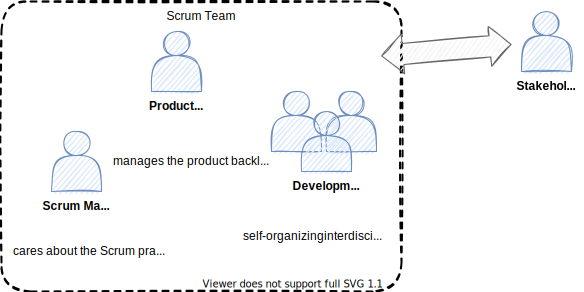

<!-- markdownlint-disable MD025 MD045 MD012 MD024 MD026 -->

# Project Management 1

## Lesson 06 - Planning, Roles in Scrum

---
<!-- _backgroundColor: lightblue -->

# Practice - Roles/Jobs/Functions in scope of PM

1. Go to the worksheet.
2. Take ⏲️3min to note down all roles/jobs/functions that come to your mind in the field of project management (your company, your own professional experience etc.).

---

# Today's session

0. What happened since last week...
1. Planning (1 & 2)
2. Roles in Scrum
3. Role Selection

---

# Sprint Planning

Sprint Planning initiates the Sprint by laying out the work to be performed for the Sprint. This resulting plan is created by the collaborative work of the entire Scrum Team.

The Product Owner ensures that attendees are prepared to discuss the most important Product Backlog items and how they map to the Product Goal.

The Scrum Team may also invite other people to attend Sprint Planning to provide advice.

---

# Sprint Planning

* Planning 1
  * **Why** is this Sprint valuable?
  * **What** can be Done this Sprint?
* Planning 2
  * **How** will the chosen work get done?

---
<!-- _backgroundColor: lightBlue -->

# Practice - Planning

* Let's go to the worksheet

---

# Scrum Roles

---

<!-- _backgroundColor: LightPink -->

# Additional Material

---

<!-- _backgroundColor:  LightGreen -->
# Practices we've used

* Sprint Planning 1
* Sprint Planning 2
* [Sociocracy 3.0 - Role Selection](https://patterns.sociocracy30.org/role-selection.html)

---
<!-- _backgroundColor: lightblue -->
# Until next session

* Our sprint 02 has started Let's scrum!
* Feel invited to take a look in the material of the last few sessions.
* You may spend some time to familiarize with some more mental models (expect them to be in the next sprint).
* My Discord is open more often than you think...

---

<!-- _backgroundColor: lightblue -->
# Check out

What's my #1 takeaway from today?

➡️ worksheet

---
<!-- _backgroundColor: lightblue -->

# Feedback

* My feedback to you.
* [Your feedback to me](https://moodle.dhbw.de/mod/feedback/view.php?id=176499)

