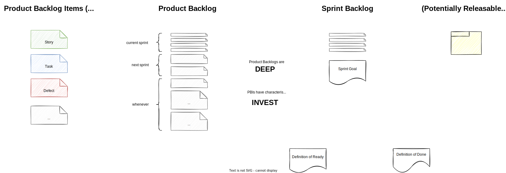

<!-- markdownlint-disable MD025 MD045 MD012 MD024 MD026 -->

# Project Management 1

## Lesson 07 - Scrum

---
<!-- _backgroundColor: lightblue -->

# Practice - xxx

1. xx

---

# Today's session

1. Recap Scrum
   1. Scrum Ceremonies
   2. Scrum Roles
2. And more on Scrum
   1. Scrum Artifacts (Product Backlog, Sprint Backlog, PBIs, DoD)
   2. Some Scrum History

---

# Scrum Ceremonies

---

# Scrum Roles

---

# Responsibilities - Development Team

* Creating a plan for the Sprint, the Sprint Backlog;
* Instilling quality by adhering to a Definition of Done;
* Adapting their plan each day toward the Sprint Goal; and,
* Holding each other accountable as professionals.

<!-- _footer: Source: [Scrum Guide](https://scrumguides.org/scrum-guide.html#developers) -->

---

# Responsibilities - Product Owner

* Developing and explicitly communicating the Product Goal;
* Creating and clearly communicating Product Backlog items;
* Ordering Product Backlog items;
* Ensuring that the Product Backlog is transparent, visible and understood.

<!-- _footer: Source: [Scrum Guide](https://scrumguides.org/scrum-guide.html#product-owner) -->

---

# Responsibilities - Scrum Master

The Scrum Master is accountable for establishing Scrum as defined in the Scrum Guide. They do this by helping everyone understand Scrum theory and practice, both within the Scrum Team and the organization.

The Scrum Master is accountable for the Scrum Team’s effectiveness. They do this by enabling the Scrum Team to improve its practices, within the Scrum framework.

Scrum Masters are true leaders who serve the Scrum Team and the larger organization.

<!-- _footer: Source: [Scrum Guide](https://scrumguides.org/scrum-guide.html#scrum-master) -->

---

# Scrum Artifacts

---

# Some Scrum History

* **1986**: The software development term scrum was first used in a paper titled **"The New New Product Development Game" by Hirotaka Takeuchi and Ikujiro Nonaka**. The term is borrowed from rugby, where a scrum is a formation of players.

* **1995**: **Jeff Sutherland and Ken Schwaber** jointly presented a first public appearance of their paper called **“The Scrum Development process”** at Object-Oriented Programming, Systems, Languages & Applications (OOPSLA) Conference, 1995 in Austin, Texas.

* **2001**: Sutherland, Schwaber, and fifteen associates got together in Snowbird, Utah, and drew the Agile Manifesto

---
<!-- _backgroundColor: lightblue -->

# Practice - Scrum Jeopardy

1. [Let's play Jeopardy](https://jeopardylabs.com/play/agile-scrum)

---
<!-- _backgroundColor: lightblue -->

# Practice - Let's look at our backlog

---
<!-- _backgroundColor: lightblue -->

# Practice - Fishbowl

1. **Invitation**
   1. How have the PM lectures so far enriched my perception about Project Management?
   2. How do I connect the dots now - between PM, Scrum and the work in my organization?
2. **How it works**
   1. 3+1 VIP chairs and the facilitator form an "inner circle". One chair stays empty. the outer circle listens.
   2. You can join the inner circle if you want to contribute. Then, one contributor leaves the inner circle.

---

<!-- _backgroundColor: LightPink -->

# Additional Material

---
<!-- _backgroundColor:  LightGreen -->
# Practices we've used

* Agile Games aka Jeopardy 😉
* [(User Experience) Fishbowl](https://www.liberatingstructures.com/18-users-experience-fishbowl/)

---

<!-- _backgroundColor: lightblue -->
# Check out

---
<!-- _backgroundColor: lightblue -->

# Feedback

* My feedback to you.
* [Your feedback to me](https://moodle.dhbw.de/mod/feedback/view.php?id=177584)

