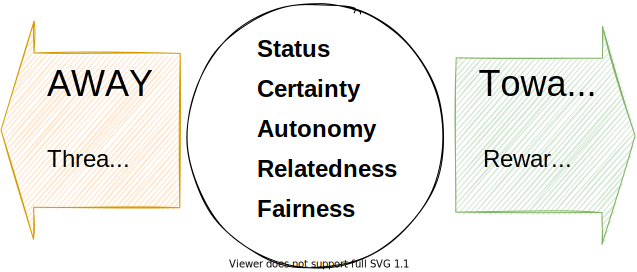

<!-- markdownlint-disable MD025 MD045 MD012 MD024 MD026 -->

# Project Management 1

## Lesson 08 - Review, Retrospective

---

# Today's session

1. Sprint Review
2. Retrospective
   1. Whole Team (Retrospective) - Definition of Done
   2. Team Retrospective - SCARF
3. Continued: PM Fishbowl

---

# The Sprint Review

The purpose of the Sprint Review is to **inspect the outcome of the Sprint and determine future adaptations**. The Scrum Team presents the results of their work to key stakeholders and progress toward the Product Goal is discussed.

During the event, the Scrum Team and stakeholders review what was accomplished in the Sprint and what has changed in their environment. Based on this information, attendees **collaborate on what to do next**. The Product Backlog may also be adjusted to meet new opportunities. The Sprint Review is a working session and the Scrum Team should avoid limiting it to a presentation.

---
<!-- _backgroundColor: lightblue -->

# Practice - Review

---

# Definition of Done

The Definition of Done is a formal description of the state of the Increment when it meets the quality measures required for the product.

The moment a Product Backlog item meets the Definition of Done, an Increment is born.

The Definition of Done creates transparency by providing everyone a shared understanding of what work was completed as part of the Increment. If a Product Backlog item does not meet the Definition of Done, it cannot be released or even presented at the Sprint Review. Instead, it returns to the Product Backlog for future consideration.

---

# A good definition of Done is...

* **clear** - write it in plain language so everyone understands and there’s no ambiguity
* **testable** - a key way to make it clear is to ensure that it’s a black and white decision whether each item in the checklist has been met
* **concise** - if everyone can remember each item, they’re more likely to tick them off
* **realistic** - document what you’re actually going to do, not your aspirations.

---

# Definition of Done - Examples

☑️ Tests written and passing
☑️ Continuous Integration build passing
☑️ Cross-browser testing done on current top 5 browsers according to analytics
☑️ Google accessibility check passed
☑️ Code peer-reviewed
☑️ Documentation updated
☑️ Acceptance criteria met

---

# Definition of Done - Examples

- “Done means coded to standards, reviewed, implemented with unit Test-Driven Development, tested with 100 percent test automation, integrated and documented.”
- A pretty good starting point... [Git | Github Checklist ! READ ME!](https://github.com/dhbw-ka-pm/mentalmodels-for-teams/wiki/Git-%7C-Github-Checklist-!-READ-ME!)

## Our acceptance criteria are not really acceptance criteria

The mental model is explained in our adapted one-pager format
It contains text and an explaining image
It's in our GitHub project
At least one content-wise review cycle is done within the team
It's published on GitHub Pages

---

# SCARF Model

---
<!-- _backgroundColor: lightblue -->

# Practice - Team Retrospective

Let's go onto the worksheet

---
<!-- _backgroundColor: lightblue -->

# Practice - Let's continue with the Fishbowl

1. **Invitation**
   1. How have the PM lectures so far enriched my perception about Project Management?
   2. How do I connect the dots now - between PM, Scrum, our project and the work in my organization?
2. **How it works**
   1. 3+1 VIP chairs and the facilitator form an "inner circle". One chair stays empty. the outer circle listens.
   2. You can join the inner circle if you want to contribute. Then, one contributor leaves the inner circle.

---

<!-- _backgroundColor: LightPink -->

# Additional Material

---
<!-- _backgroundColor:  LightGreen -->
# Practices we've used

* Scrum Sprint Review
* Scrum Sprint Retrospective
* (User Experience) Fishbowl

---

<!-- _backgroundColor: lightblue -->
# Check out

---
<!-- _backgroundColor: lightblue -->

# Feedback

* My feedback to you.
* Your feedback to me.

