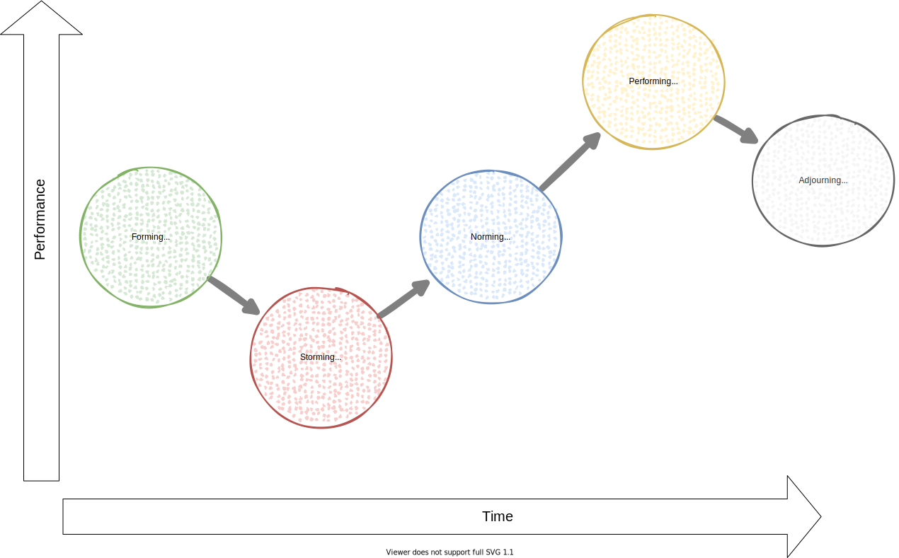

<!-- markdownlint-disable MD025 MD045 MD012 MD024 MD026 -->

# Project Management 1

## Lesson 09 - Planning

---

# Today's session

1. Some new mental models
2. Planning
   1. The Why and What
   2. The How

---

<!-- _backgroundColor: Wheat -->

# Mental Models of the Week

* Mental Models - Teams and Organizations
* Mental Models - Systems Thinking

---
<!-- _backgroundColor: Wheat -->

# Mental Models - Teams and Organizations

* 5 Dysfunctions of a team
* Conway's Law
* Tuckman Model
* Goodhart's Law
* Five Disciplines (of a learning organization)

---
<!-- _backgroundColor: Wheat -->

# 5 Dysfunctions of a team

---
<!-- _backgroundColor: Wheat -->

# Conway's Law

"Organizations, who design systems, are constrained to produce designs which are copies of the communication structures of these organizations."

---
<!-- _backgroundColor: Wheat -->

# Tuckman Model

Focus on the way in which a team tackles a task from the initial formation of the team through to the completion of the project.

---
<!-- _backgroundColor: Wheat -->

# Goodhart's Law

* When a measure becomes a target, it is subsequently no longer a good measure.
* Or: When we set one specific goal, people will tend to optimize for that objective regardless of the consequences.

## Examples

* If an employee is rewarded by the number of cars sold each month, they will try to sell more cars, even at a loss.
* If you pay developers to fix bugs, you may get a sort of cobra effect: Bug bounties can incentivize breeding bugs the way cobra bounties incentivized breeding cobras.

---
<!-- _backgroundColor: Wheat -->

# Five Disciplines (of a learning organization)

---
<!-- _backgroundColor: Wheat -->

# Mental Models - Systems Thinking

* Iceberg Model
* Johari Window
* Ladder of Inference
* Blind men & an Elephant
* Cynefin Model

---
<!-- _backgroundColor: Wheat -->

# Iceberg Model

---
<!-- _backgroundColor: Wheat -->

# Johari Window

---
<!-- _backgroundColor: Wheat -->

# Ladder of Inference

---
<!-- _backgroundColor: Wheat -->

# Blind men & an Elephant

---
<!-- _backgroundColor: Wheat -->

# Cynefin Model

---

<!-- _backgroundColor: lightblue -->
# Practice

## Planning 1 - Why, What

---

<!-- _backgroundColor: lightblue -->
# Practice

## Planning 2

---

<!-- _backgroundColor: LightPink -->

# Additional Material

none!

---
<!-- _backgroundColor:  LightGreen -->
# Practices we've used

* Scrum - Planning
  * Planning 1 - Why, What
  * Planning 2 - How ([Liberating Structures - What I Need From You](https://www.liberatingstructures.com/24-what-i-need-from-you-winfy/))

---

<!-- _backgroundColor: lightblue -->
# Check out

---
<!-- _backgroundColor: lightblue -->

# Feedback

* My feedback to you.
* Your feedback to me

