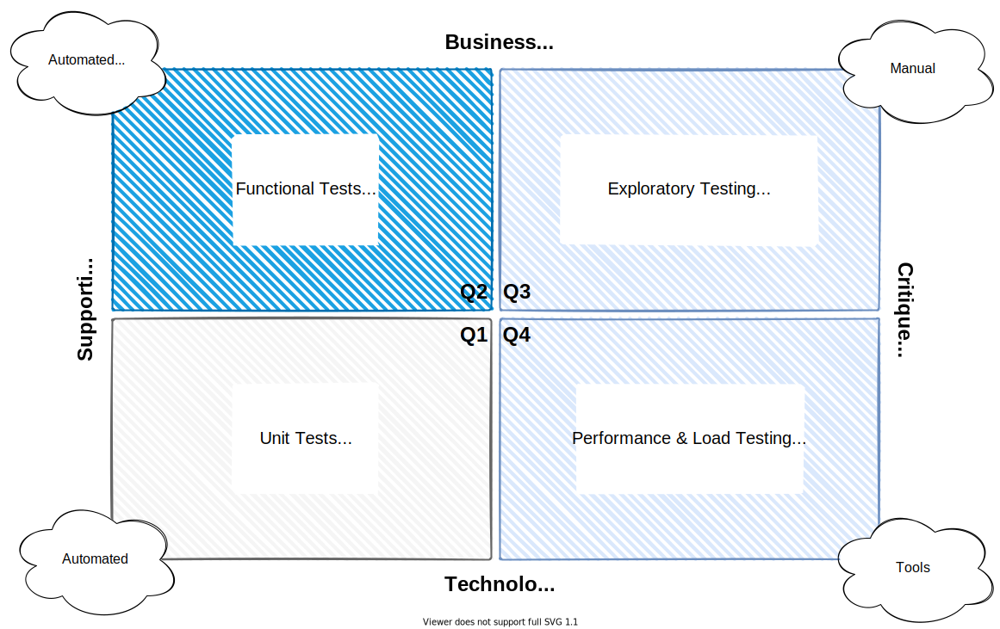
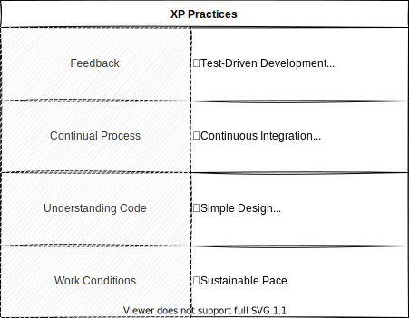

<!-- markdownlint-disable MD025 MD045 MD012 MD024 MD026 -->

# Project Management 1

## Lesson 10 - Roundup

---

# Today's session

1. Backlog Refinement
2. Agile Testing
3. XP Programming
4. Scrum Values
5. Clean Code Practices
6. Thinking in Patterns & Antipatterns

---

<!-- _backgroundColor: lightblue -->

# Practice - Backlog Refinement

---

# Agile Testing

**Agile testing** is software testing that follows the best practices of **Agile development**. Agile testing involves all members of a **cross-functional agile team**, with special expertise contributed by testers, to ensure delivering the business value desired by the customer at frequent intervals, working at a sustainable pace.

* Methodology
  * Test-Driven Development (TDD)
  * Acceptance Test-Driven Development (ATDD)
  * Behavior-Driven Development (BDD) ([Cucumber](https://cucumber.io/) anyone?)
  * Exploratory Testing
  * ...

---

# Agile Testing Quadrants

---

# XP - Definition, Origins

XP is a style of software development focusing on excellent applications of programming techniques, clear communication, and teamwork which allows us to accomplish things we previously could not even imagine.

Origins: Mid 90s at Daimler Crysler, Kent Beck

---

# XP - Values, Principles, Practices

## Values

* Courage, Feedback, Respect, Communication, Simplicity

## Principles

* Humanity, Self-Similarity, Improvement, Flow, Opportunity, Quality, Accepted responsibility

---

# XP - Practices

---

<!-- _backgroundColor: lightblue -->

# Practice - Why XP practices will never work!

* Find and collect causes/reasons why XP practices cannot work at all
  * on technical level
  * process wise
  * from a human perspective
  * in real-world projects, organizations
* Now, try to solve the causes/reasons found.
  * What can be done to neutralize an effect and turn it into the opposite direction?
  * What experiments can be started trying to minimze barriers?
  * Which of the causes/reasons are not relevant at all having the right attitude?

---

# Scrum Values

<!-- _footer: Source: [scrum.org](https://scrumorg-website-prod.s3.amazonaws.com/drupal/2018-05/ScrumValues-Tabloid.pdf) -->
---

# CCD - What is it, Origins

* An initiative for more professionalism in software development
* Professionalism = Awareness + Principles
* Authors: Stefan Lieser, Ralf Westphal
* See also: [Clean Code, the book](https://www.oreilly.com/library/view/clean-code-a/9780136083238/)

<!-- _footer: Source (poster): [http://michael.hoennig.de/download/CCD-Poster.pdf](http://michael.hoennig.de/download/CCD-Poster.pdf) -->

---

# Thinking in Patterns & Antipatterns

A pattern is a general, reusable solution to a commonly occurring problem within a given context.

An anti-pattern is a common response to a recurring problem that is usually ineffective and risks being highly counterproductive.

* ➡️ Architecture Patterns ➡️ Software Architecture Patterns ➡️ Patterns for xyz

## Examples

* **Anti-Pattern "Design by committee"** - The result of having many contributors to a design, but no unifying vision
* **SW Pattern "Facade"** - Provide a unified interface to a set of interfaces in a subsystem. Facade defines a higher-level interface that makes the subsystem easier to use.

---
<!-- _backgroundColor:  LightGreen -->
# Practices we've used

* [Backlog Refinement](https://www.agilealliance.org/glossary/backlog-refinement)
* [Liberating Structures - TRIZ](https://www.liberatingstructures.com/6-making-space-with-triz/)

---

<!-- _backgroundColor: lightblue -->
# Check out

---
<!-- _backgroundColor: lightblue -->

# Feedback

* My feedback to you.
* Your feedback to me

